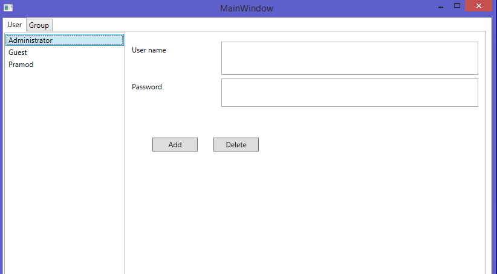
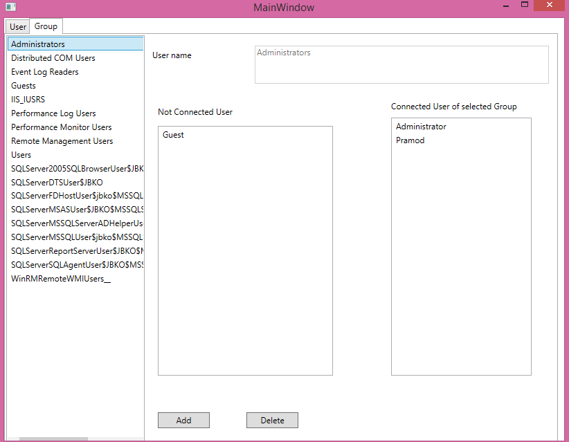

<!DOCTYPE html PUBLIC "-//W3C//DTD XHTML 1.0 Transitional//EN" "http://www.w3.org/TR/xhtml1/DTD/xhtml1-transitional.dtd">
<html>
    <head><link rel="stylesheet" type="text/css" href="description/Combined.css,0:HeaderFooterSprite,0:Header.NonMtps,1:LinkList;/Areas/Centers/Themes/StandardDevCenter/Content:0,/Areas/Epx/Themes/Base/Content:1&amp;amp;hashKey=9DC1BBE1613B3277EDB1CD608DD6B172" xmlns="http://www.w3.org/1999/xhtml" />
<link type="text/css" rel="stylesheet" xmlns="http://www.w3.org/1999/xhtml" />
<link rel="stylesheet" type="text/css" href="description/adcf341d-3f1e-4a69-8c58-f7a53ffcf1bdCombined.css,0:HeaderFooterSprite,0:Footer.NonMtps,1:LinkList;/Areas/Centers/Themes/StandardDevCenter/Content:0,/Areas/Epx/Themes/Base/Content:1&amp;amp;hashKey=400B4048FC6DD81C6C2705AF12442ECA" xmlns="http://www.w3.org/1999/xhtml" />
<link type="text/css" rel="stylesheet" xmlns="http://www.w3.org/1999/xhtml" />

        
<body>
    

        <h1>All Active directory Operation C#.net WPF List box</h1>
         
        

            

                    

                        <label for="Technologies">Technologies</label>
                        

                            C#, WPF, Active Directory, XAML, .NET Framework 3.5 SP1, Windows General
                        

                    

                    

                        <label for="Topics">Topics</label>
                        

                            Active Directory, Drag and Drop, ListBox, System.Director<wbr />yServices, System.Director<wbr />yServices.Accou<wbr />ntManagement;, System.Security<wbr />.Principal, GroupPrincipal, PrincipalContex<wbr />t, UserPrincipal
                        

                    

                

                    <label for="Platforms">Platforms</label>
                    

                        Desktop
                    

                

                

                    <label for="Requirements">Requirements</label>
                    

                        
                    

                

                

                    <label for="LastUpdated">Primary language</label>
                    
en-US

                

                

                    <label for="LastUpdated">Updated</label>
                    
9/30/2014

                

                

                    <label for="License">License</label>
                    

                        <a href="license.rtf">MS-LPL</a>

                

                

                    

                        <a data-link="online" href="http://code.msdn.microsoft.com/Active-directory-Opration-ecb1c752">View this sample online</a>
                    

                

            

        

        
                   

    
<h1>Introduction</h1>

<em>Windows Active directry Managment With Darag and droap list box.</em>

<h1>Building the Sample</h1>

<em>You have the permision who can run the applicaion with windows active directry accesses permision defualt Administrator.</em>

Description

<em>This application shows the how to access the windows active direcotry and you can use acording to ypur requrment.</em>

<em>in this application you have followig functionality :-</em>

1.List of the Cuurent active directory user's.

2.You can create new the Windows User.

3. You can delete the windows User.

4.You can manage the user with diffrence groups.

5.You can assign the user in to the goroup and remove from group by the simpale drag and droap opration.

&nbsp;

etc.

<em>In this application you can find the solution for drag and droap functionality to One listbox to another list box.</em>

<em> 
</em>

<em>Please followinf the snapshot its more helpful for you</em>

&nbsp;

<em>this is the user tab wich is showing the all user's of Current windows active directory.</em>

<em></em>

Second image showing Group Tab .

In this tab you can assign the groups for user then user behave according to the group.

&nbsp;

This is the some declaration code these basic for the start of the application, with use of this you can access the Windows active directory.

&nbsp;

C#

Edit|Remove

csharp
<pre class="hidden"> public static PrincipalContext insPrincipalContext = new PrincipalContext(ContextType.Machine);
        public static GroupPrincipal SelectedGroup;
        private void ListGroups()
        {
            GroupPrincipal insGroupPrincipal = new GroupPrincipal(insPrincipalContext);
            insGroupPrincipal.Name = &quot;*&quot;;
            SearchGroups(insGroupPrincipal);
        }
        private void SearchGroups(GroupPrincipal parGroupPrincipal)
        {
            lstGroup.Items.Clear();
            PrincipalSearcher insPrincipalSearcher = new PrincipalSearcher();
            insPrincipalSearcher.QueryFilter = parGroupPrincipal;
            PrincipalSearchResult&lt;Principal&gt; results = insPrincipalSearcher.FindAll();
            foreach (Principal p in results)
            {
                lstGroup.Items.Add(p);

            }

        }
        private void ListUsers()
        {
            UserPrincipal insUserPrincipal = new UserPrincipal(insPrincipalContext);
            insUserPrincipal.Name = &quot;*&quot;;
            SearchUsers(insUserPrincipal);
        }</pre>

<pre class="csharp">&nbsp;public&nbsp;static&nbsp;PrincipalContext&nbsp;insPrincipalContext&nbsp;=&nbsp;new&nbsp;PrincipalContext(ContextType.Machine);&nbsp;
&nbsp;&nbsp;&nbsp;&nbsp;&nbsp;&nbsp;&nbsp;&nbsp;public&nbsp;static&nbsp;GroupPrincipal&nbsp;SelectedGroup;&nbsp;
&nbsp;&nbsp;&nbsp;&nbsp;&nbsp;&nbsp;&nbsp;&nbsp;private&nbsp;void&nbsp;ListGroups()&nbsp;
&nbsp;&nbsp;&nbsp;&nbsp;&nbsp;&nbsp;&nbsp;&nbsp;{&nbsp;
&nbsp;&nbsp;&nbsp;&nbsp;&nbsp;&nbsp;&nbsp;&nbsp;&nbsp;&nbsp;&nbsp;&nbsp;GroupPrincipal&nbsp;insGroupPrincipal&nbsp;=&nbsp;new&nbsp;GroupPrincipal(insPrincipalContext);&nbsp;
&nbsp;&nbsp;&nbsp;&nbsp;&nbsp;&nbsp;&nbsp;&nbsp;&nbsp;&nbsp;&nbsp;&nbsp;insGroupPrincipal.Name&nbsp;=&nbsp;&quot;*&quot;;&nbsp;
&nbsp;&nbsp;&nbsp;&nbsp;&nbsp;&nbsp;&nbsp;&nbsp;&nbsp;&nbsp;&nbsp;&nbsp;SearchGroups(insGroupPrincipal);&nbsp;
&nbsp;&nbsp;&nbsp;&nbsp;&nbsp;&nbsp;&nbsp;&nbsp;}&nbsp;
&nbsp;&nbsp;&nbsp;&nbsp;&nbsp;&nbsp;&nbsp;&nbsp;private&nbsp;void&nbsp;SearchGroups(GroupPrincipal&nbsp;parGroupPrincipal)&nbsp;
&nbsp;&nbsp;&nbsp;&nbsp;&nbsp;&nbsp;&nbsp;&nbsp;{&nbsp;
&nbsp;&nbsp;&nbsp;&nbsp;&nbsp;&nbsp;&nbsp;&nbsp;&nbsp;&nbsp;&nbsp;&nbsp;lstGroup.Items.Clear();&nbsp;
&nbsp;&nbsp;&nbsp;&nbsp;&nbsp;&nbsp;&nbsp;&nbsp;&nbsp;&nbsp;&nbsp;&nbsp;PrincipalSearcher&nbsp;insPrincipalSearcher&nbsp;=&nbsp;new&nbsp;PrincipalSearcher();&nbsp;
&nbsp;&nbsp;&nbsp;&nbsp;&nbsp;&nbsp;&nbsp;&nbsp;&nbsp;&nbsp;&nbsp;&nbsp;insPrincipalSearcher.QueryFilter&nbsp;=&nbsp;parGroupPrincipal;&nbsp;
&nbsp;&nbsp;&nbsp;&nbsp;&nbsp;&nbsp;&nbsp;&nbsp;&nbsp;&nbsp;&nbsp;&nbsp;PrincipalSearchResult&lt;Principal&gt;&nbsp;results&nbsp;=&nbsp;insPrincipalSearcher.FindAll();&nbsp;
&nbsp;&nbsp;&nbsp;&nbsp;&nbsp;&nbsp;&nbsp;&nbsp;&nbsp;&nbsp;&nbsp;&nbsp;foreach&nbsp;(Principal&nbsp;p&nbsp;in&nbsp;results)&nbsp;
&nbsp;&nbsp;&nbsp;&nbsp;&nbsp;&nbsp;&nbsp;&nbsp;&nbsp;&nbsp;&nbsp;&nbsp;{&nbsp;
&nbsp;&nbsp;&nbsp;&nbsp;&nbsp;&nbsp;&nbsp;&nbsp;&nbsp;&nbsp;&nbsp;&nbsp;&nbsp;&nbsp;&nbsp;&nbsp;lstGroup.Items.Add(p);&nbsp;
&nbsp;
&nbsp;
&nbsp;&nbsp;&nbsp;&nbsp;&nbsp;&nbsp;&nbsp;&nbsp;&nbsp;&nbsp;&nbsp;&nbsp;}&nbsp;
&nbsp;
&nbsp;
&nbsp;&nbsp;&nbsp;&nbsp;&nbsp;&nbsp;&nbsp;&nbsp;}&nbsp;
&nbsp;&nbsp;&nbsp;&nbsp;&nbsp;&nbsp;&nbsp;&nbsp;private&nbsp;void&nbsp;ListUsers()&nbsp;
&nbsp;&nbsp;&nbsp;&nbsp;&nbsp;&nbsp;&nbsp;&nbsp;{&nbsp;
&nbsp;&nbsp;&nbsp;&nbsp;&nbsp;&nbsp;&nbsp;&nbsp;&nbsp;&nbsp;&nbsp;&nbsp;UserPrincipal&nbsp;insUserPrincipal&nbsp;=&nbsp;new&nbsp;UserPrincipal(insPrincipalContext);&nbsp;
&nbsp;&nbsp;&nbsp;&nbsp;&nbsp;&nbsp;&nbsp;&nbsp;&nbsp;&nbsp;&nbsp;&nbsp;insUserPrincipal.Name&nbsp;=&nbsp;&quot;*&quot;;&nbsp;
&nbsp;&nbsp;&nbsp;&nbsp;&nbsp;&nbsp;&nbsp;&nbsp;&nbsp;&nbsp;&nbsp;&nbsp;SearchUsers(insUserPrincipal);&nbsp;
&nbsp;&nbsp;&nbsp;&nbsp;&nbsp;&nbsp;&nbsp;&nbsp;}</pre>

<h1>Source Code Files</h1>
<ul>
<li><em>source code file name #1 - summary for this source code file.</em> </li><li><em><em>source code file name #2 - summary for this source code file.</em></em>
</li></ul>
<h1>More Information</h1>

<em>If you have any additional information you can mail me info@jbko.in or prmdpandit@gmail.com.</em>

    

</body>
</html>
